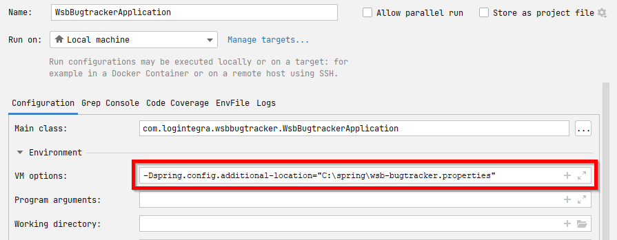

# WSB Bugtracker

## Konfiguracja

W pliku `config/wsb-bugtracker-sample.properties` przygotowaliśmy wzór pliku konfiguracyjnego. Skopiuj go do dowolnego miejsca, a następnie uzupełnij odpowiednimi danymi. Co więcej, przy każdym uruchomieniu lub kompilowaniu awizacji, użyj zmiennej `spring.config.additional-location="..."` do określenia lokalizacji tego pliku.

W przypadku korzystania z argumentów JVM będzie to np.:

```java
// Dla Windows
-Dspring.config.additional-location="C:\spring\wsb-bugtracker.properties"
// Dla Linux
-Dspring.config.additional-location="/home/xxxx/spring/wsb-bugtracker.properties"
```

W IntelliJ możemy to ustawić w szczegółach konfiguracji (select obok przycisków _Run_, _Debug_ itp.):



Podczas kompilacji projektu powinniśmy natomiast użyć np.:

```bash
./gradlew build -Dspring.config.additional-location="/home/logintegra/config/wsb-bugtracker.properties"
```

Możemy nawet użyć zmiennej środowiskowej: `SPRING_CONFIG_ADDITIONAL-LOCATION`.

### Konfiguracja bazy danych

1. Utwórz pustą bazę danych PostgreSQL.
1. Ustaw odpowiednie wartości związane z bazą danych w `.env` (wzorując się na `.env.example`):
1. Dodaj klasę z adnotacją `@Entity` — po uruchomieniu aplikacji powinna się utworzyć odpowiednia tabela.

### Lombok

Żeby IntelliJ nie czepiał się o brak bezargumentowych konstruktorów w klasach domenowych, trzeba zainstalować wtyczkę Lomboka, ewentualnie pomieszać coś w ustawieniach adnotacji -> https://stackoverflow.com/a/60647751

### Spring Security

Konfigurację Spring Security zaczerpnęliśmy w dużym stopniu z <https://medium.com/@gustavo.ponce.ch/spring-boot-spring-mvc-spring-security-mysql-a5d8545d837d>.

#### Główny administrator

Przy pierwszym uruchomieniu aplikacja tworzy użytkownika administracyjnego — jego nazwą użytkownika jest _admin_, natomiast hasło powinniśmy ustawić w zmiennej `ADMIN_PASSWORD` pliku `.env`.
"# bugtracker-users-and-files" 
"# wsb-users-and-files" 
